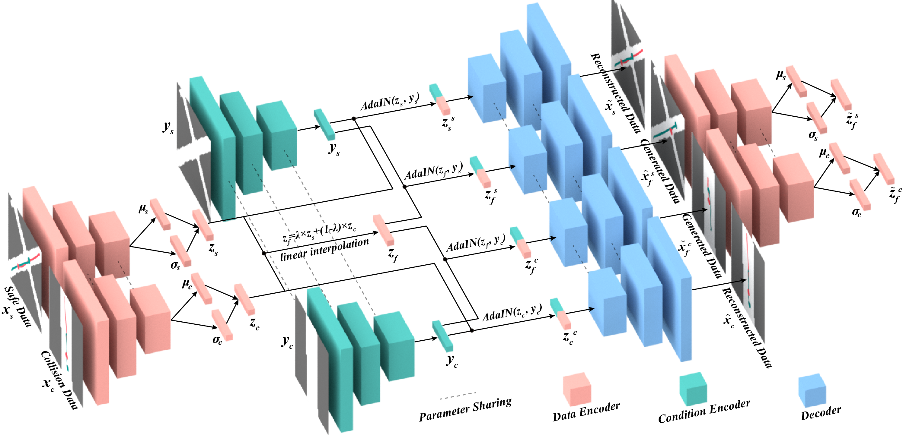
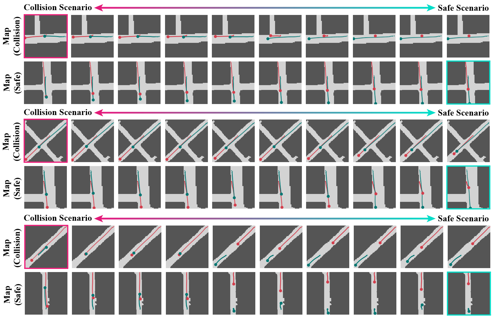

# ICRA2020-CMTS
The pytorch code for ICRA2020 paper 'CMTS: Conditional Multiple Trajectory Synthesizer for Generating Safety-critical Driving Scenarios' [Paper Link](https://arxiv.org/abs/1910.00099)

## Environment
Python 3.7  
Pytorch 1.0

## Dataset
The processed Argoverse dataset can be downloaded with this [Link](https://drive.google.com/open?id=1ubsosU7TD_Q91vswEfASKGrcrV1htkyt). After downloading the data files (two for trajectories, two for maps), you need to put them into the *data* folder.

## Visualization
Some tools for visualization are provided in *tools* folder. This tools will read the files from *sample* folder, which are saved during the training or generate stage.

## Structure
The structure of our model is shown below. The tool used to draw this structure is [Blender](https://www.blender.org/), which is an open-source 3D modeling tool. 
 

## Generated Examples
Some interpolation examples are shown below: 
 

